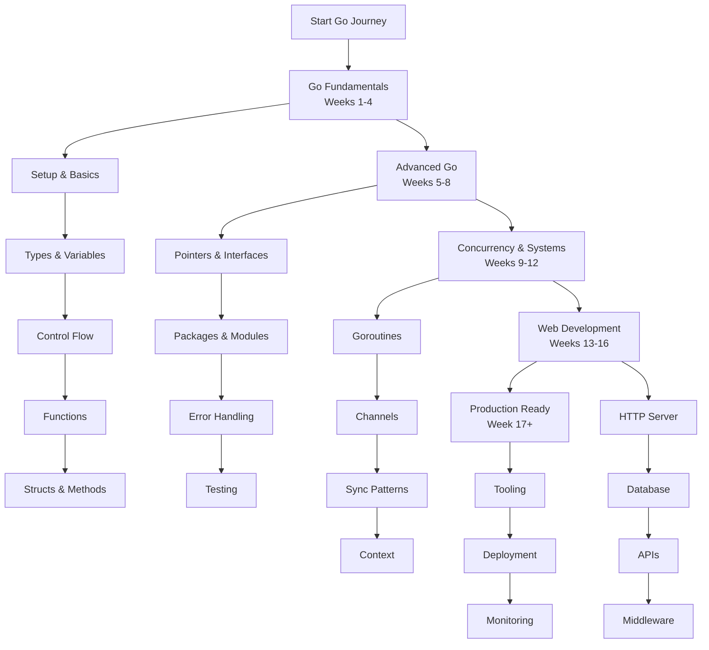

# Go (Golang) Developer Learning Path: A Structured Curriculum

This comprehensive roadmap provides a structured approach to mastering Go development. The curriculum is designed sequentially, with each module building upon previous knowledge to ensure a solid foundation and progressive skill development.

---

## Phase 1: Go Fundamentals & Basic Syntax (Weeks 1-4)

*   [**Module 1: Introduction & Development Environment**](https://github.com/example/go-intro/#readme)
    *   Go Overview: History, Philosophy, and Key Characteristics (Simple, Fast, Concurrent)
    *   Understanding Go's Place in Modern Development: Systems, Web, Cloud Native
    *   Installing Go and Configuring GOPATH, GOROOT
    *   Setting Up Development Environment: VS Code, GoLand, or Vim with Go plugins
    *   Creating, Building, and Running a "Hello World" Application

*   [**Module 2: Basic Syntax & Program Structure**](https://github.com/example/go-syntax/#readme)
    *   Go Program Structure: Package declaration, Imports, Functions
    *   The `main` function and executable packages
    *   Code Organization and Formatting with `gofmt`
    *   Comments: Single-line (`//`) and Multi-line (`/* */`)
    *   Command-line arguments with `os.Args`

*   [**Module 3: Variables, Constants, and Data Types**](https://github.com/example/go-variables/#readme)
    *   Variable Declaration: Short declaration (`:=`) vs `var` keyword
    *   Basic Types: `int`, `float64`, `bool`, `string`, `byte`, `rune`
    *   Zero values and Type inference
    *   Constants: `const` keyword and `iota` for enumerated constants
    *   Type conversion and casting

*   [**Module 4: Operators and Control Flow**](https://github.com/example/go-control-flow/#readme)
    *   Arithmetic Operators: `+`, `-`, `*`, `/`, `%`
    *   Comparison Operators: `==`, `!=`, `<`, `>`, `<=`, `>=`
    *   Logical Operators: `&&`, `||`, `!`
    *   Conditional Statements: `if`, `else if`, `else`
    *   Switch Statements: Expression switches and Type switches
    *   Looping: `for` loop (Go's only loop construct)

*   [**Module 5: Functions**](https://github.com/example/go-functions/#readme)
    *   Function Declaration: Parameters, Return types, Multiple returns
    *   Named return values and Naked returns
    *   Variadic functions and Defer statements
    *   Function types and First-class functions
    *   Anonymous functions and Closures

*   [**Module 6: Arrays, Slices, and Maps**](https://github.com/example/go-collections/#readme)
    *   Arrays: Fixed-size collections
    *   Slices: Dynamic arrays, slicing operations, `make()` function
    *   Map: Key-value pairs, initialization, and operations
    *   Range keyword for iteration
    *   Working with strings as byte slices

---

## Phase 2: Advanced Go Programming (Weeks 5-8)

*   [**Module 7: Pointers and Memory Management**](https://github.com/example/go-pointers/#readme)
    *   Pointer basics: `&` and `*` operators
    *   Pointer receivers vs Value receivers
    *   Go's garbage collector and memory management
    *   Stack vs Heap allocation
    *   Avoiding common pointer pitfalls

*   [**Module 8: Structs and Methods**](https://github.com/example/go-structs/#readme)
    *   Struct declaration and initialization
    *   Embedded structs and composition (Go's approach to OOP)
    *   Method declaration with pointer vs value receivers
    *   Field tags and JSON marshaling/unmarshaling
    *   Struct comparison and copying

*   [**Module 9: Interfaces and Polymorphism**](https://github.com/example/go-interfaces/#readme)
    *   Interface declaration and implementation (implicit)
    *   Empty interface `interface{}` and type assertions
    *   Type switches for runtime type checking
    *   Interface composition and best practices
    *   Common interfaces: `Stringer`, `Reader`, `Writer`

*   [**Module 10: Packages and Modules**](https://github.com/example/go-packages/#readme)
    *   Package organization and visibility (Uppercase exports)
    *   Go Modules: `go.mod`, versioning, and dependency management
    *   Importing third-party packages
    *   Creating and publishing your own packages
    *   Vendor directory and reproducible builds

*   [**Module 11: Error Handling**](https://github.com/example/go-error-handling/#readme)
    *   Go's error philosophy: Errors as values
    *   The `error` interface and creating custom errors
    *   Error checking patterns and the `errors` package
    *   Wrapping errors with `fmt.Errorf` and `%w` verb
    *   Panic and Recover for exceptional situations

*   [**Module 12: Testing and Benchmarking**](https://github.com/example/go-testing/#readme)
    *   Writing unit tests with the `testing` package
    *   Table-driven tests and test fixtures
    *   Benchmarking code performance
    *   Example tests for documentation
    *   Test coverage and profiling

---

## Phase 3: Concurrency & Systems Programming (Weeks 9-12)

*   [**Module 13: Goroutines and Concurrency Basics**](https://github.com/example/go-goroutines/#readme)
    *   Goroutines: Lightweight threads with `go` keyword
    *   Understanding the Go scheduler and GOMAXPROCS
    *   Sync package: WaitGroup, Mutex, RWMutex
    *   Race condition detection with `-race` flag
    *   Concurrency patterns and best practices

*   [**Module 14: Channels and Communication**](https://github.com/example/go-channels/#readme)
    *   Channels: Typed conduits for goroutine communication
    *   Buffered vs Unbuffered channels
    *   Channel operations: Send, Receive, Close
    *   Select statement for multiple channel operations
    *   Channel patterns: Pipeline, Fan-out, Fan-in

*   [**Module 15: Advanced Concurrency Patterns**](https://github.com/example/go-concurrency-patterns/#readme)
    *   Context package for cancellation and deadlines
    *   Worker pools and resource management
    *   Rate limiting and backpressure
    *   Atomic operations with `sync/atomic`
    *   Once and Pool types from sync package

*   [**Module 16: Systems Programming**](https://github.com/example/go-systems/#readme)
    *   File I/O operations and directory traversal
    *   Command execution with `os/exec`
    *   Environment variables and command-line flags
    *   Signal handling and process management
    *   Cross-compilation for different platforms

---

## Phase 4: Web Development & APIs (Weeks 13-16)

*   [**Module 17: HTTP Server and Client**](https://github.com/example/go-http/#readme)
    *   Creating HTTP servers with `net/http`
    *   Handling routes and HTTP methods
    *   Request parsing: Query parameters, Form data, JSON bodies
    *   HTTP client for making external requests
    *   Middleware pattern and chaining

*   [**Module 18: RESTful API Development**](https://github.com/example/go-rest-api/#readme)
    *   REST principles and resource design
    *   JSON marshaling/unmarshaling with struct tags
    *   Routing with gorilla/mux or chi router
    *   API versioning strategies
    *   Documentation with Swagger/OpenAPI

*   [**Module 19: Database Integration**](https://github.com/example/go-database/#readme)
    *   Database/sql package and drivers
    *   Connection pooling and prepared statements
    *   ORM vs raw SQL: Using GORM or sqlx
    *   Transactions and error handling
    *   Migration tools and database design

*   [**Module 20: Authentication and Authorization**](https://github.com/example/go-auth/#readme)
    *   JWT (JSON Web Tokens) implementation
    *   Password hashing with bcrypt
    *   Middleware for authentication
    *   OAuth2 integration
    *   Role-based access control (RBAC)

---

## Phase 5: Production-Ready Go Development

*   [**Module 21: Go Tooling**](https://github.com/example/go-tooling/#readme)
    *   Go command: build, test, fmt, vet, mod
    *   Static analysis with golangci-lint
    *   Dependency vulnerability checking
    *   Code generation with go generate
    *   Profiling and performance analysis

*   [**Module 22: Configuration and Logging**](https://github.com/example/go-config/#readme)
    *   Configuration management: Environment variables, config files
    *   Structured logging with log/slog or zerolog
    *   Log levels and rotation
    *   Feature flags and dynamic configuration
    *   Secret management best practices

*   [**Module 23: Deployment and Containerization**](https://github.com/example/go-deployment/#readme)
    *   Building minimal Docker images with multi-stage builds
    *   Deployment strategies: Blue-green, canary
    *   Health checks and graceful shutdown
    *   Monitoring with Prometheus and metrics
    *   Tracing with OpenTelemetry

*   [**Module 24: Microservices and Distributed Systems**](https://github.com/example/go-microservices/#readme)
    *   gRPC for service communication
    *   Protocol Buffers for efficient serialization
    *   Service discovery and load balancing
    *   Message queues with NATS or RabbitMQ
    *   Distributed tracing and monitoring

---

## Phase 6: Specialization & Advanced Topics

*   [**Module 25: CLI Tool Development**](https://github.com/example/go-cli/#readme)
    *   Cobra library for powerful CLI applications
    *   Viper for configuration management
    *   Interactive prompts and color output
    *   Shell completion and man page generation
    *   Cross-platform CLI tools

*   [**Module 26: Cloud Native Go**](https://github.com/example/go-cloud/#readme)
    *   AWS SDK for Go
    *   Kubernetes operators with client-go
    *   Serverless functions with AWS Lambda
    *   Terraform provider development
    *   Cloud deployment patterns

*   [**Module 27: Performance Optimization**](https://github.com/example/go-performance/#readme)
    *   CPU and memory profiling
    *   Escape analysis and memory optimization
    *   Benchmarking and performance testing
    *   Compiler optimizations and inline functions
    *   Efficient data structures and algorithms

*   [**Module 28: Capstone Project**](https://github.com/example/go-capstone/#readme)
    *   **Choose Your Specialization:**
        *   **Web Service:** REST API with database, authentication, and deployment
        *   **CLI Tool:** Utility application with advanced features
        *   **Microservice:** Distributed system with multiple services
        *   **Systems Utility:** Low-level tool for system management

---

## Learning Resources

*   **Official Documentation:** [Go Documentation](https://golang.org/doc/)
*   **Effective Go:** [Go Programming Guidelines](https://golang.org/doc/effective_go.html)
*   **Go Blog:** [Official Go Blog](https://blog.golang.org/)
*   **Books:** "The Go Programming Language", "Go in Action"
*   **Practice:** Exercism Go Track, LeetCode with Go

*Note: Replace `https://github.com/example/` with actual repository links for each module.*
